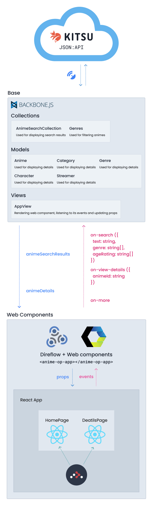

# アニメ OP • Architecture

The architecture consists of three main pillars:

* **Base App**: Entry point of the web app, handles web request and storing data.
* **[Kitsu JSON:API](https://kitsu.docs.apiary.io/)**: The source of truth for the data: search results, animes, genres, etc.
* **Web Components**: Contains the components which directly manipulate the DOM and build up the whole app UI.



## Base App

It's the core of the web app. Consumes both **Web Components** and **[Kitsu JSON:API](https://kitsu.docs.apiary.io/)**.

Handles:

* Fetching and storing data (in memory)
* Listening to _web components_ events and updating its properties.

### Models

* AnimeDetails

```typescript
type AnimeDetails = {
  id: string
  attributes: {
    synopsis: string,
    titles: {
      [lang: string]: string
    }[],
    canonicalTitle: string,
    averageRating: number,
    ageRating: 'G' | 'PG' | 'R',
    ageRatingGuide: string,
    subtype: 'TV' | 'OVA' | 'ONA' | 'special' | 'movie' | 'music',
    youtubeVideoId?: string
  },
  relations: {
    characters: Character[],
    genres: Genre[],
    categories: Category[],
    streamers: Streamer[]
  }
};
```

* Genre

```typescript
type Genre = {
  id: string,
  attributes:  {
    slug: string,
    title: string
  }
};
```

* Category

```typescript
type Category = {
  id: string,
  attributes: {
    slug: string,
    title: string
  }
};
```

* Character

```typescript
type Character = {
  id: string,
  attributes:  {
    names: {
      [lang: string]: string
    }[],
    canonicalName: string,
    otherNames: string[],
    description: string,
    image?: {
      original?: string /* url */
    }
  }
};
```

* Streamer

```typescript
type Streamer = {
  id: string,
  attributes: {
    siteName: string
    url?: string
  }
};
```

### Collections

* AnimeSearchResults

```typescript
type AnimeSearchResults = {
  id: string,
  attributes: {
    canonicalTitle: string,
    averageRating: number,
    subtype: 'TV' | 'OVA' | 'ONA' | 'special' | 'movie' | 'music',
    posterImage: {
      original: number
    }
  }
};
```

* Genres

```typescript
type Genres = Genre[];
```

## Web Components

The web components part consists of an AMD compiled web component called `<anime-op-app>`:
  * Handles UI events
  * Handles navigation with React Router

### Development

This is considered a separate module, it has it's own dependencies and can be run separately.

### Build

For usage in the _Base App_ it is build as an AMD module which registers the web component.

### Component Hierarchy

WIP

## Integration

App integration _(base, web components, and API)_ will happen following these steps:

* On the _web component_ an event that needs external data is triggered
  * Due to an user interaction
  * From navigating
* The triggered event can be 'on-search', 'on-more' or 'on-details'
* That event is listened on the _AppView_ on the _Base App_
* Required data is retrieved from the _API_ and updated for the _web component_
