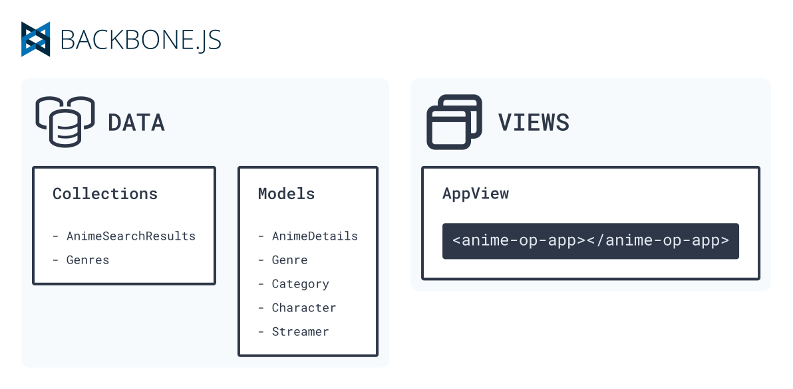

# アニメ OP • Architecture

The web app consists of two basic parts:

* [The Web Components Library](#web-components-library)
* [The Base App](#base-app)

## Web Components Library

It's responsible for rendering the main UI, handling user events, and navigating between pages.


Internally, components are built up of [React.js](https://reactjs.org/) components.

[React Router](https://reactrouter.com/) handles navigation between **home page** and **details page**.

> For reference of how those pages work please head to [the project's overview](./overview.md).


The _React_ app uses [Direflow](https://direflow.io/) for web component encapsulation, and in combination with [_Webpack_](https://webpack.js.org/) it builds the web component into a single [_AMD_](https://github.com/amdjs/amdjs-api/wiki/AMD) bundle.

The bundle will register the web-component into the DOM when it is loaded.

The final output it's a single web component called `anime-op-app`:

```html
<anime-op-app></anime-op-app>
```

* It has the same props as the _React App component_ which can be updated by JavaScript.
* It triggers events for requesting data:
  * `on-search`: Triggered when a new search for animes is requested by the user.
  * `on-more`: Triggers when it needs more animes.
  * `on-view-details`: Triggers when there is navigation to the details page.

TODO: Add more details about the events such as input.

### Development

The code can be found at [_/web-components_](../web-components).

> For folder structure and instructions on how to run and package the web components lib, please refer to its [_README.md_](../web-components/README.md).

## Base App

It's responsible for:

* Listening to web components events
* Updating its props based on events triggered
* Fetching, parsing, and storing data in respective data structures



The data in the app follows [Backbone](https://backbonejs.org/)'s principles of _Collections and Models_.

As we consume a [JSON:API](https://jsonapi.org/), two more libraries were added in top of backbone for model relations and parsing:

* [Backbone-relational.js](http://backbonerelational.org/)
* [backbone-relational-jsonapi](https://github.com/xbill82/backbone-relational-jsonapi)

### Collections

```typescript
type AnimeSearchResults = {
  id: string,
  attributes: {
    canonicalTitle: string,
    averageRating: number,
    subtype: 'TV' | 'OVA' | 'ONA' | 'special' | 'movie' | 'music',
    posterImage: {
      original: number
    }
  }
};
```

* `AnimeSearchResults` - Used for displaying search results on the home page.

```typescript
type Genres = Genre[];
```

* `Genres` - Used for filtering animes by genre.

### Models

```typescript
type AnimeDetails = {
  id: string
  attributes: {
    synopsis: string,
    titles: {
      [lang: string]: string
    }[],
    canonicalTitle: string,
    averageRating: number,
    ageRating: 'G' | 'PG' | 'R',
    ageRatingGuide: string,
    subtype: 'TV' | 'OVA' | 'ONA' | 'special' | 'movie' | 'music',
    youtubeVideoId?: string
  },
  relations: {
    characters: Character[],
    genres: Genre[],
    categories: Category[],
    streamers: Streamer[]
  }
};
```

* `AnimeDetails` - Used for displaying detailed anime information at the details page.

```typescript
type Genre = {
  id: string,
  attributes:  {
    slug: string,
    title: string
  }
};
```

* `Genre` - Complementary information about the anime. Also used for filtering.

```typescript
type Category = {
  id: string,
  attributes: {
    slug: string,
    title: string
  }
};
```

* `Category` - Complementary information about the anime.

```typescript
type Character = {
  id: string,
  attributes:  {
    names: {
      [lang: string]: string
    }[],
    canonicalName: string,
    otherNames: string[],
    description: string,
    image?: {
      original?: string /* url */
    }
  }
};
```

* `Character` - Complementary information about the anime.

```typescript
type Streamer = {
  id: string,
  attributes: {
    siteName: string
    url?: string
  }
};
```

* `Streamer` - Complementary information about the anime.

### Development

The code can be found at [_/base-app_](../base-app).

> For folder structure and instructions on how to run, please refer to its [_README.md_](../base-app/README.md).

## Backend • JSON:API

An open [JSON:API](https://jsonapi.org/) called [Kitsu](https://kitsu.docs.apiary.io/) is consumed for the getting the app's data.

## Integration


The _Base App_ loads the web component through [Require.js](https://requirejs.org/) and it is called as the markup of the _AppView_.

Then the _AppView_ attaches events listeners to the web component.

When an event is triggered, an HTTP request is made to the respective API resource through a _collection_ or _model_.

When the data its returned, the _AppView_ updates the corresponding DOM props of the web component.
